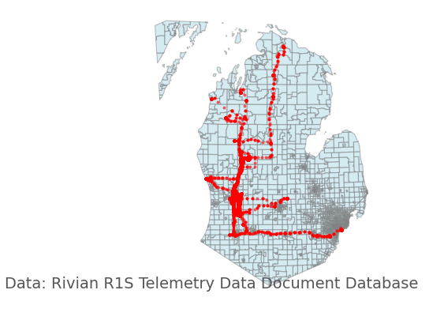

# Rivian Geo Data Plotting


Plotting the gnSSLocation data from my Rivian R1S across Michigan with InterSystems Cloud Document and Databricks

Given a bucket of telemetry data as json, recorded once every 5 minutes:

```json
{
    "data": {
        "vehicleState": {
            "__typename": "VehicleState",
            "cloudConnection": {
                "__typename": "VehicleCloudConnection",
                "lastSync": "2024-07-06T01:02:45.598Z"
            },
            "gnssLocation": {
                "__typename": "VehicleLocation",
                "latitude": 42.6175385,
                "longitude": -85.5416794,
                "timeStamp": "2024-07-06T01:02:41.081Z"
            },
            "gnssSpeed": {
                "__typename": "TimeStampedFloat",
                "timeStamp": "2024-07-06T01:02:41.081Z",
                "value": 0
            },
            "gnssBearing": {
                "__typename": "TimeStampedFloat",
                "timeStamp": "2024-07-06T01:02:41.081Z",
                "value": 187.6345
            },
            "gnssAltitude": {
                "__typename": "TimeStampedNullableFloat",
                "timeStamp": "2024-07-06T01:02:41.081Z",
                "value": 195.621
            },

```

Stored in a Document Database 


[RivianDocDb.java](databricks_rivian_irisdocdb/RivianDocDb.java)


Plotted w/ PySpark + Geopandas


<details>

```python
    import geopandas as gpd
    import geodatasets
    from shapely.geometry import Polygon

    dbtablequery = f"(SELECT TOP 1000 lat,longitude FROM JSON_TABLE(deezwatts2 FORMAT COLLECTION, '$' COLUMNS (lat VARCHAR(20) path '$.whip2.data.vehicleState.gnssLocation.latitude', longitude VARCHAR(20) path '$.whip2.data.vehicleState.gnssLocation.longitude' ))) AS temp_table;"

    # Read data from InterSystems Document Database via query above
    df = (spark.read.format("jdbc") \
    .option("url", "jdbc:IRIS://k8s-05868f04-a88b7ecb-5c5e41660d-404345a22ba1370c.elb.us-east-1.amazonaws.com:443/USER") \
    .option("jars", "/Volumes/cloudsql/iris/irisvolume/intersystems-document-1.0.1.jar") \
    .option("driver", "com.intersystems.jdbc.IRISDriver") \
    .option("dbtable", dbtablequery) \
    .option("sql", "SELECT * FROM temp_table;") \
    .option("user", "SQLAdmin") \
    .option("password", "REDACTED") \
    .option("connection security level","10") \
    .option("sslConnection","true") \
    .load())
    # sdoh map is fantastic with bounding boxes
    michigan = gpd.read_file(geodatasets.get_path("geoda.us_sdoh"))

    gdf = gpd.GeoDataFrame(
        df.toPandas(), 
        geometry=gpd.points_from_xy(df.toPandas()['longitude'].astype(float), df.toPandas()['lat'].astype(float)), 
        crs=michigan.crs #"EPSG:4326"
    )

    # used this fantastic tool to draw my bounding box https://www.keene.edu/campus/maps/tool/
    polygon = Polygon([
        (
            -87.286377,
            45.9664245
        ),
        (
            -81.6503906,
            45.8134865
        ),
        (
            -82.3864746,
            42.1063737
        ),
        (
            -84.7814941,
            41.3520721
        ),
        (
            -87.253418,
            42.5045029
        ),
        (
            -87.5610352,
            45.8823607
        )
        ])

    ax = michigan.clip(polygon).plot(color="lightblue", alpha=0.5,linewidth=0.8, edgecolor='gray')
    ax.axis('off')
    ax.annotate("Data: Rivian R1S Telemetry Data via InterSystems Document Database", xy=(0.01, .085), xycoords='figure fraction', fontsize=14, color='#555555')

    gdf.plot(ax=ax, color="red", markersize=1.50, alpha=0.5, figsize=(200,200))
```

</details>



Documentation and Errata over @ [Deez Watts - A Rivian Data Adventure](https://www.deezwatts.com)
Backs assets for a Community Post @ [InterSystems Community](https://community.intersystems.com/post/rivian-geolocation-plotting-iris-cloud-document-and-databricks)
 
## Author
Ron Sweeney [sween](https://www.github.com/sween)